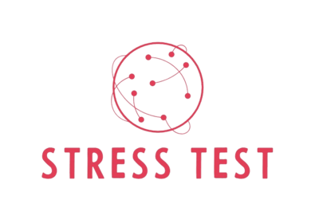

Traduções:

* [Inglês](README.md)
* [Francês](README_fr.md)

---

# 🌐 CLI de Teste de Estresse (stress-test)



Bem-vindo ao CLI de Teste de estresse desenvolvido em Go! Este projeto permite realizar testes de estresse em um serviço web, especificando a URL, o número total de requisições e a quantidade de chamadas simultâneas.

## 📑&nbsp;Sumário

- [📖 Introdução](#introdução)
- [🛠 Pré-requisitos](#pré-requisitos)
- [⚙️ Instalação](#instalação)
- [🚀 Uso](#uso)
- [🔍 Exemplos](#exemplos)
- [🤝 Contribuição](#contribuição)
- [📜 Licença](#licença)

## 📖&nbsp;Introdução

Esta ferramenta CLI permite realizar testes de estresse em um serviço web, especificando parâmetros como a URL, o número total de requisições e a quantidade de chamadas simultâneas. Ela gera um relatório detalhado com informações sobre as requisições feitas.

## 🛠&nbsp;Pré-requisitos

Certifique-se de ter os seguintes itens instalados antes de continuar:

- [Go](https://golang.org/doc/install)
- [Docker](https://www.docker.com/get-started)

## ⚙️&nbsp;Instalação

1. Clone este repositório:

    ```sh
    git clone git@github.com:rodrigoachilles/stress-test.git
    cd stress-test
    ```

2. Construa a imagem Docker:

    ```sh
    docker build -t stress-test-app .
    ```

## 🚀&nbsp;Uso

Após construir a imagem Docker, você pode executar o teste de estresse usando o seguinte comando:

```sh
docker run stress-test-app --url=http://example.com --requests=1000 --concurrency=10
```

### 📄&nbsp;Parâmetros da Linha de Comando

- `--url`: URL do serviço web a ser testado.
- `--requests`: Número total de requisições a serem feitas.
- `--concurrency`: Número de chamadas simultâneas.

### 📋&nbsp;Relatório

Após o teste, um relatório será gerado com as seguintes informações:
- Tempo total gasto
- Número total de requisições realizadas
- Número de requisições com status HTTP 200
- Distribuição de outros códigos de status HTTP (ex.: 404, 500, etc.)

## 🔍&nbsp;Exemplos

Aqui estão alguns exemplos de uso do CLI de teste de estresse:

- Testar um serviço web com 1000 requisições e 10 chamadas simultâneas:
    ```sh
    docker run stress-test-app --url=http://example.com --requests=1000 --concurrency=10
    ```

## 🤝&nbsp;Contribuição

Sinta-se à vontade para abrir issues ou enviar pull requests para melhorias e correções de bugs.

## 📜&nbsp;Licença

Este projeto está licenciado sob a Licença MIT.
